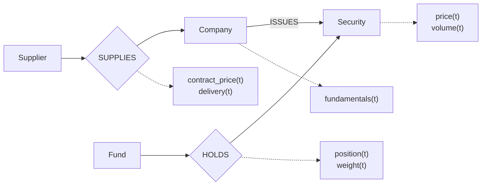
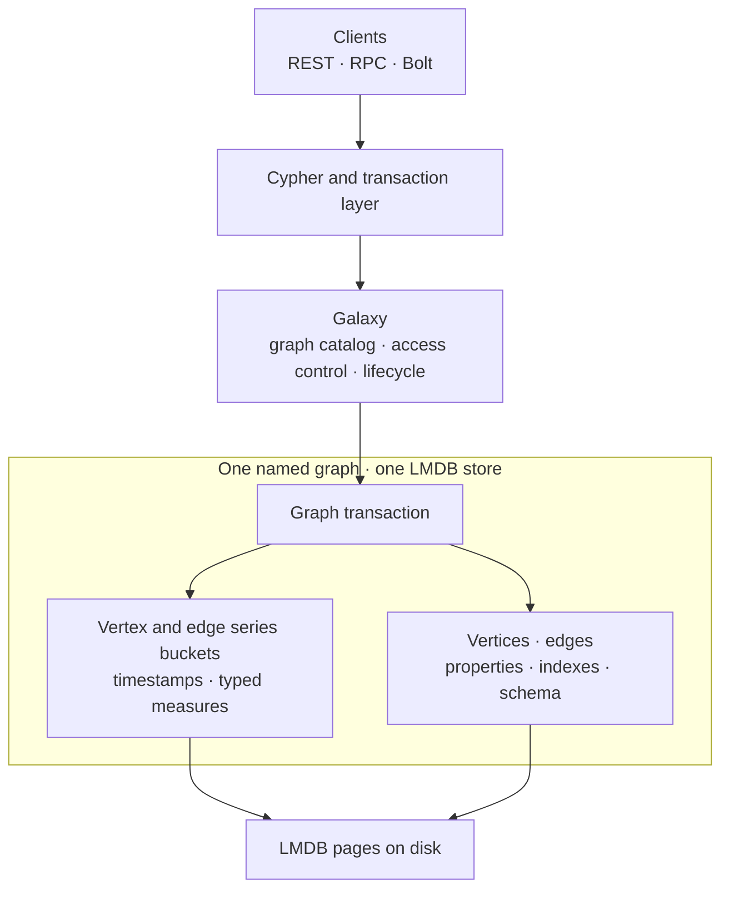
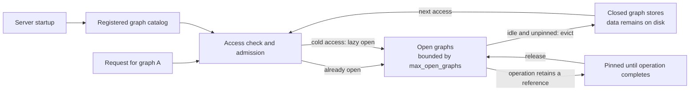

# GraphFin

<p align="center">
  <strong>Graph relationships and time-series observations, in one database.</strong><br>
  Model relationships and the observations that change along them — together, in one transactional system.
</p>

<p align="center">
  <a href="https://github.com/ziangziangziang/graphfin/actions/workflows/ci.yml">
    
  </a>
  <a href="RELEASE.md">
    
  </a>
  <a href="LICENSE">
    
  </a>
  
  
</p>

<p align="center">
  
</p>

<p align="center">
  <a href="#why-graphfin">Why GraphFin?</a>
  ·
  <a href="#30-second-example">30-second example</a>
  ·
  <a href="#reliability-evidence">Reliability</a>
  ·
  <a href="#getting-started">Getting started</a>
  ·
  <a href="docs/README.md">Documentation</a>
  ·
  <a href="README_CN.md">中文</a>
</p>

## Why GraphFin?

GraphFin starts from a simple idea: **many graph problems are also time-series problems**.

A lot of real-world data is both **connected** and **changing**.

In investment research, a company is connected to suppliers, subsidiaries, securities, funds, industries, and counterparties. At the same time, the facts attached to those entities and relationships — prices, holdings, fundamentals, exposures, volumes, ownership stakes — evolve continuously.

Traditionally, those two dimensions often live in different systems. The graph database knows **what is connected**. The time-series system knows **what changed and when**.

The application is left responsible for keeping identities aligned, coordinating reads and writes, and moving between the two models.

GraphFin lets vertices and edges own native time-series fields, so applications can traverse the relationships that matter and work with their changing observations through the same data model.

It is built for connected, time-varying data — with **investment analytics as its first major use case**, while keeping the underlying database general-purpose.

## Graph + time series

In GraphFin, time series belong directly to the graph elements they describe.

A security vertex can own its price series. A company can carry its fundamentals. A `HOLDS` edge can carry a position series. A supplier relationship can track changing volume, price, or lead time.



The diamonds represent graph edges; the dotted lines show the series owned by each vertex or edge.

The graph provides the **context**.
The series provides the **history**.

Together, they make questions like these natural to model:

> Which suppliers are connected to companies in this portfolio, and how have their operating metrics changed over the last quarter?

> Which funds are exposed to this issuer, and how did those positions change over time?

GraphFin is designed for workloads where selecting the right time series depends on understanding the relationships around them first.

The relationships tell you **where to look**.
The series tell you **what happened over time**.

## 30-second example

Declare a sensor, give it a native series field, and record an observation.

Run these statements separately against a fresh graph on a running GraphFin server:

```cypher
CALL db.createVertexLabel('Sensor', 'id', 'id', 'INT64', false);
CALL db.createSeriesField('Sensor', 'readings',
  [{name:'temperature', type:'DOUBLE'}], {}) YIELD field RETURN field;
CREATE (s:Sensor {id:1});
MATCH (s:Sensor {id:1})
CALL series.append(s, 'readings',
  {ts:datetime('2024-01-02 00:00:00'), temperature:21.5})
YIELD written RETURN written;
MATCH (s:Sensor {id:1}) RETURN series.latest(s, 'readings') AS latest;
```

The final query returns the observation at `2024-01-02 00:00:00` with `temperature: 21.5`. The series belongs to the sensor. Add relationships between sensors, machines, or sites, and use those relationships to select whose readings to query.

The executable [telemetry](demo/SeriesTelemetry/telemetry.py) and [financial](demo/SeriesFinancial/financial.py) examples show client requests, range reads, aggregates, and export. REST and Bolt return collection cells as JSON text; see the [client contract](docs/architecture/09-series-client-contracts.md) for decoding rules.

## Why use GraphFin?

**One identity.** A series belongs to a vertex or edge in a named graph. The application does not need a second store's identifier just to find that element's observations.

**One transaction domain.** Graph records and series buckets live in the same graph store. Changes made within one graph transaction commit or roll back together. Separate requests still create separate transactions.

**Graph-first selection.** Follow a holding, supplier, or dependency relationship to find the entities that matter, then read their observations. The graph narrows the question before the series answers it.

**Native storage.** Observations are stored in timestamp-ordered, encoded buckets, with typed measures and point/range operations. Applications can correct a measure or read a window without treating an entire history as an ordinary property value.

## Reliability evidence

Storing relationships and observations together is useful only if they stay together through failure and recovery.

The current tests check stored values, schema, and isolation across synthetic finance and telemetry fixtures. The scope matters:

| Area | Evidence and boundary |
| --- | --- |
| **Crash atomicity** | Graph and series share the graph's LMDB transaction. The client gate includes durable-mode recovery after `SIGKILL`, checking acknowledged data after restart. Killing a mixed graph/series transaction while it is in flight or around commit acknowledgement remains an open qualification item. |
| **Restart / recovery** | The smoke gate restarts the server and checks vertex and edge observations across tenant graphs, including corrections and null measures. Client tests also cover series schema and data after restart. |
| **Snapshot / restore** | A quiescent multi-graph snapshot is restored into an independent directory and its vertex and edge series are compared with expected values. The client gate also exercises `lgraph_backup`. Concurrent and interrupted snapshot qualification remains open. |
| **Eviction / reopen** | Four tenant graphs run with an open-graph cap of two. Tests verify eviction, reopen, corrected values, rejected stale updates, and delete/recreate isolation. Sustained pressure with active readers needs further qualification. |
| **HA leader failure** | A three-node cluster loses its leader after acknowledged writes. Tests verify the new leader, restart the failed node, and reconcile exact vertex and edge series on every replica. In-flight writes, network partitions, and extended soak are outside this gate. |

The evidence lives in the [lifecycle and snapshot tests](test/integration/test_merge_series.py), [client and recovery tests](test/integration/test_timeseries.py), and [HA tests](test/integration/test_merge_series_ha.py). The [qualification plan](docs/testing/post-merge.md) tracks the remaining failure scenarios.

## Current qualification

**GraphFin 0.1.0-alpha is for evaluation of the qualified feature set.** It is not yet a production-qualified release.

The [recorded candidate](release/notes/0.1.0-alpha.md#validation-and-artifacts), `5e31bacf50c2e1c0c2a9f6916f3a2c80f6ea46bc`, passed these isolated gates on September 22, 2026:

| Gate | Result | Scope |
| --- | --- | --- |
| Unit | **110/110** | Selected series, lifecycle, placement, routing, and migration component regressions |
| Smoke | **4/4** | Finance and telemetry fixtures across eviction, restart, recreation, and snapshot restore |
| Clients | **14/14** | Client contracts and recovery checks, with the real `neo4j==4.4.6` driver |
| HA | **2/2** | Series reconciliation after leader loss and restart, for both domain fixtures |

All four gates recorded **zero failures and zero required skips**. The candidate used the pinned arm64 compile environment, CentOS 7.9, GCC 8.4.0, and an incremental `RelWithDebInfo` build. Source identity, binary hashes, commands, XML results, and logs are recorded with the runs.

These results apply to that candidate and those tests. Final clean-build and package qualification, compatibility fixtures, full sanitizers, and extended failure/soak testing remain open. Packages and the GitHub prerelease have not been published. See the [release status](RELEASE.md).

## Architecture

Each named graph has its own LMDB store. Ordinary graph records and native series buckets share that store's transaction boundary.



Series are organized by their owning element, field, and bucket start time. A point lookup locates the relevant bucket; a range read walks the relevant history. Corrections rewrite the affected bucket through the same storage transaction.

The transaction boundary is **one graph**. Cross-graph transactions and a globally consistent multi-graph snapshot are not promised.

See the [architecture index](docs/architecture/README.md) for storage, query paths, replication, and recovery details.

## Multi-graph architecture

Having many graphs should not require keeping every graph open.

GraphFin loads the graph catalog at startup and opens a graph's storage on demand. An open-graph cap bounds admission; idle, unpinned graphs can be evicted and reopened later. Active operations retain their graph resources until they finish.



The catalog describes the graph population. The open set serves the active workload. Catalog metadata, caches, and queries still consume memory, so a graph-count cap is not a complete process-RAM limit.

> **100K graph benchmark:** A recorded multi-graph run registered **100,000 graphs**, with a **0.28 s restart**, **951.4 MiB reported RSS**, and a verified snapshot restore of all 100,000 graphs. It ran on arm64 with a 4-CPU quota and 6 GiB container memory limit. These are historical lifecycle measurements at commit `fd7e996b`, not capacity or series-throughput guarantees for the merged alpha. [Full report and environment](benchmark/scaling/results/PHASE2-100K-HEAD.md).

Whole-graph placement, routing, fencing, and migration-state components are also present. Live shard forwarding and migration data movement remain unfinished; the lazy-open architecture above operates within a server. See [sharding status](docs/architecture/12-sharding-status.md).

## What GraphFin provides

| Capability | What it gives applications |
| --- | --- |
| Property graph | Labeled vertices and edges, ordinary properties, indexes, and graph queries inherited from TuGraph |
| Vertex and edge series | Named fields with typed measures, microsecond timestamps, and null values |
| Series writes | Append or replace a point, update a measure, value-based compare-and-set, and clear |
| Series reads | Exact-point, inclusive-range, earliest/latest, count, and aggregate operations |
| Graph transactions | Graph records and series buckets in one transaction domain per graph |
| Multi-graph lifecycle | Separate stores, lazy open, bounded admission, eviction, and lifecycle metrics |
| Client interfaces | Cypher through REST, RPC, and Bolt, with Python examples and explicit wire contracts |
| Recovery and HA | Restart, snapshot/restore, backup tools, and replication with the qualification scope above |

## Use cases

**Finance.** Model issuers, securities, funds, suppliers, and counterparties. Attach prices and fundamentals to entities, and positions or weights to relationships. Use the graph to select exposures and the series to examine how their observations changed.

**Telemetry.** Model machines, sensors, sites, and upstream dependencies. Attach temperature, throughput, or health measurements to the equipment and relationships they describe. Follow a dependency to find the relevant readings.

**Dependency systems.** Model services, components, supply chains, or infrastructure. Track latency, volume, capacity, or lead time alongside the connections that give those measurements meaning.

The database provides the relationships and observations. Applications provide entity resolution, feeds, domain models, and statistical or causal analysis.

## Current limitations

The current boundaries are explicit:

- **Mutable observations, not revision history.** Each timestamp holds one point. Append replaces an existing point, and omitted measures become null. Earlier revisions and “what was known then?” queries are not available. Ordinary graph edges do not encode historical validity by themselves.
- **Time and numeric conventions belong to the application.** Timestamps have microsecond precision but no timezone identifier. New non-null `DOUBLE` values must be finite. Exact fixed-scale quantities can use `INT64` by application convention; there is no native financial decimal type.
- **Compare-and-set is value-based.** It checks the expected current value, but provides neither persisted request deduplication nor revision tokens. Replaying a write after another writer's correction can overwrite newer data.
- **Large reads and ingestion need care.** Range bounds are inclusive, and results are materialized. Bounded streaming, stable cursors, and native batch ingestion remain planned.
- **Series schema changes are constrained.** Measure redefinition and unsafe field-ID-shifting changes are guarded. Stable series identity and a reviewed migration path remain roadmap work.
- **Clients have explicit contracts.** REST/Bolt collection results require JSON decoding; large `INT64` values need precision-safe handling. Series writes use Cypher; GQL series syntax is only partially supported.
- **Distributed sharding is incomplete.** Placement components do not yet provide live forwarding, integrated receiver fencing, replicated placement authority, or migration data movement. Intra-graph sharding, cross-shard queries, and distributed transactions are not supported features.
- **Release qualification is incomplete.** The four passing gates do not cover every crash, partition, resource-pressure, or upgrade scenario. Upstream-to-fork in-place upgrades, downgrades, and mixed-version HA are not qualified.

The [capability matrix](docs/product.md), [client contract](docs/architecture/09-series-client-contracts.md), and [test plan](docs/testing/post-merge.md) describe these boundaries in more detail.

## Getting started

Follow the [developer quick start](docs/getting-started.md) to clone with submodules, provision the pinned compile image, build this fork, and start a local server. It includes the server command and executable examples.

After provisioning the documented environment:

```bash
# Build the fork; retain objects on subsequent runs.
CLEAN=0 JOBS=2 BUILD_TYPE=RelWithDebInfo bash dev/phase0/build.sh

# Reuse the binaries; these commands do not rebuild.
bash ci/merge/run.sh unit
bash ci/merge/run.sh smoke
```

The runner uses isolated test databases and records source, binary, and image provenance. The quick start also explains how to provision the pinned client driver and run the client and three-node HA gates.

Public GraphFin packages and runtime images are not yet published. Upstream TuGraph runtime images do not contain GraphFin's native series and multi-graph changes. Legacy `lgraph_*` executable and API names remain in use.

## Documentation and roadmap

| Read | For |
| --- | --- |
| [Documentation index](docs/README.md) | Current product docs and inherited reference manuals |
| [Developer quick start](docs/getting-started.md) | Build, local server, examples, and test commands |
| [Product and capability boundaries](docs/product.md) | Implemented behavior and remaining work |
| [Architecture](docs/architecture/README.md) | Storage, lifecycle, replication, and recovery |
| [Series client contracts](docs/architecture/09-series-client-contracts.md) | Types, wire formats, errors, and retry rules |
| [Qualification plan](docs/testing/post-merge.md) | Failure scenarios and performance profiles |
| [Release status](RELEASE.md) and [candidate notes](release/notes/0.1.0-alpha.md) | Recorded results and publication blockers |
| [Roadmap](docs/roadmap.md) | Delivery order and exit criteria |

The next steps are stronger operational qualification, stable series identity, batched ingestion and bounded reads, integrated whole-graph sharding, and historical analysis primitives.

Inherited TuGraph manuals remain useful reference material. Their version numbers and feature claims are separate from GraphFin's current qualification record.

## Author, TuGraph attribution and license

**GraphFin author:** Ziang Zhang ([ziang.zhang@idefinity.com](mailto:ziang.zhang@idefinity.com)).

GraphFin is derived from [TuGraph](https://github.com/TuGraph-family/tugraph-db), using **TuGraph 4.5.2** as its engine compatibility baseline. It builds on that project's property-graph engine, query layer, client interfaces, and replication infrastructure.

Upstream authorship, copyright notices, and the [Apache-2.0 license](LICENSE) are retained. GraphFin's product version, `0.1.0-alpha`, is separate from the inherited engine and on-disk compatibility version.
