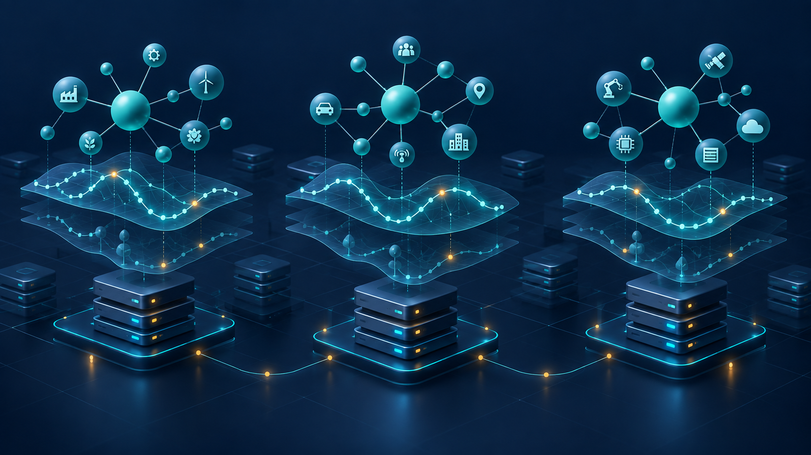

# GraphFin

**A general-purpose graph database with native time-series data.**

[中文](README_CN.md) · [Documentation](docs/README.md) · [Quick start](docs/getting-started.md) · [Test plan](docs/testing/post-merge.md) · [Release status](RELEASE.md)



Store relationships and the observations that change over time, together.
GraphFin combines TuGraph's property-graph foundation with native vertex and edge
series, resource-aware multi-graph storage, and replication infrastructure.
Financial dependencies, supply chains and equipment telemetry use the same APIs.

**Status: Alpha qualification in progress.** The confirmed product version is
`0.1.0-alpha`; this is not a production-readiness claim. Whole-graph sharding
currently provides control-plane components, with live forwarding and migration
data movement still to come. See [TASK.md](TASK.md) for the release blockers.

## What you can build

| Capability | What it enables |
| --- | --- |
| Relationships with measurements | Typed series on vertices and edges: instrument prices, sensor readings and dependency weights |
| Native series operations | Append/replace points, update a measure, compare-and-set, point/range/endpoint reads and aggregates |
| Many independent graphs | Separate graph stores, lazy loading and a cap on simultaneously open graphs |
| Replication foundation | Existing HA machinery, subject to merged-series failover and recovery qualification |
| Placement and routing components | Persistent identities, placement epochs and routing decisions; public distributed forwarding remains unfinished |
| Familiar interfaces | Cypher, REST, RPC, Bolt and Python, with explicit wire contracts |

An application can follow `SUPPLIES` relationships and read selected suppliers'
measurements. The same operation follows `FEEDS` relationships between machines.
GraphFin supplies storage and query primitives; applications supply domain models
and statistical analysis.

```cypher
CALL db.createVertexLabel('Sensor', 'id', 'id', 'INT64', false);
CALL db.createSeriesField('Sensor', 'readings',
  [{name:'temperature', type:'DOUBLE'}], {}) YIELD field RETURN field;
CREATE (s:Sensor {id:1});
MATCH (s:Sensor {id:1})
CALL series.append(s, 'readings',
  {ts:datetime('2024-01-02 00:00:00'), temperature:21.5})
YIELD written RETURN written;
MATCH (s:Sensor {id:1}) RETURN series.latest(s, 'readings') AS latest;
```

Run these statements separately against a fresh graph. Executable
[telemetry](demo/SeriesTelemetry/telemetry.py) and
[financial](demo/SeriesFinancial/financial.py) examples show client requests and export.

## Start locally

Follow the [developer quick start](docs/getting-started.md) to provision the
environment, build this fork and start a server. Upstream TuGraph runtime images
do not contain these merged changes.

```bash
# After provisioning the documented compile image:
CLEAN=0 JOBS=2 BUILD_TYPE=RelWithDebInfo bash ci/phase0/build.sh

# Reuse the binaries; these commands do not rebuild:
bash ci/merge/run.sh unit
bash ci/merge/run.sh smoke
```

The runner isolates test databases, fails on required skips, and records
source/binary/image provenance. The [test plan](docs/testing/post-merge.md)
separates fast regression, three-node HA and dedicated scale/soak gates.

## Capability boundaries

- One mutable point per timestamp today. Revisions, knowledge-time queries and
  temporal graph selection remain planned.
- Microsecond timestamps carry no timezone identifier; applications agree on a time basis.
- Range bounds are inclusive; bounded streaming/cursor APIs remain planned.
- Append replaces an existing point. Value-based CAS detects a mismatched value,
  but is not request deduplication or a revision-token protocol.
- New DOUBLE measures must be finite. Collection cells and INT64 handling follow
  the [client contract](docs/architecture/09-series-client-contracts.md).
- Whole-graph sharding does not imply intra-graph sharding, cross-shard queries,
  distributed transactions or online migration.

Read the [capability matrix](docs/product.md), [roadmap](docs/roadmap.md) and
[release checklist](RELEASE.md) before selecting deployment scope. The hero is a
conceptual illustration, not a certified cluster topology.

## Development and attribution

GraphFin is a fork of [TuGraph](https://github.com/TuGraph-family/tugraph-db).
Upstream authorship, copyright notices and the [Apache-2.0 license](LICENSE)
are retained. Legacy `lgraph_*` executable/API names and engine compatibility
version `4.5.2` remain distinct from GraphFin's product version.

Report issues and propose changes in this repository. Commit format:
`test(series): cover snapshot restore across tenants`. Inherited reference
manuals are indexed separately from the current product documentation.
