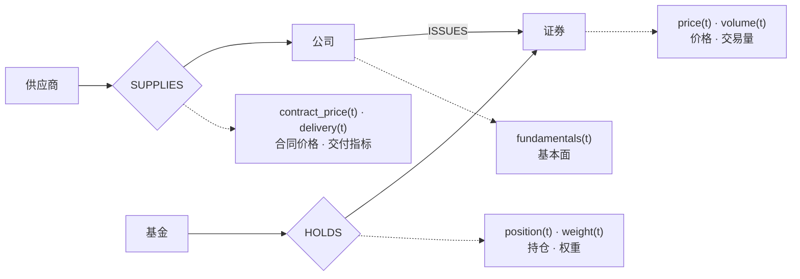
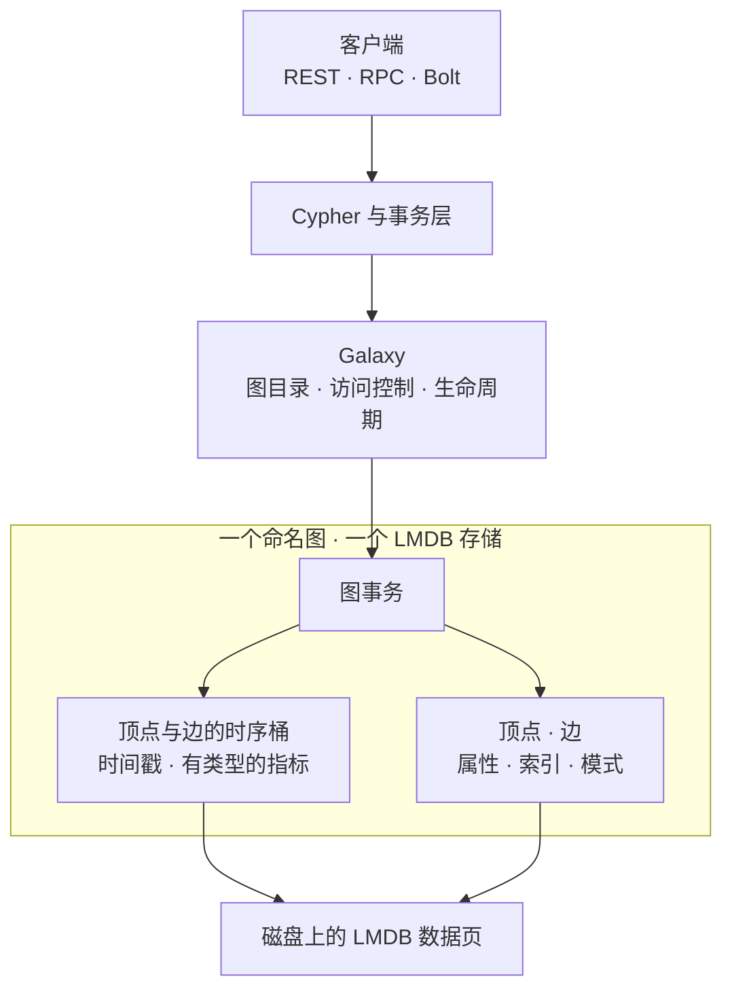
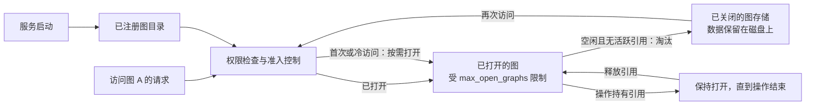

# GraphFin

<p align="center">
  <strong>变化和关联，一手掌握。</strong><br>
  GraphFin是一款支持时序数据的图数据库，也是一款支持图关系的时序数据库。
</p>

<p align="center">
  <a href="https://github.com/ziangziangziang/graphfin/actions/workflows/ci.yml">
    
  </a>
  <a href="RELEASE.md">
    
  </a>
  <a href="LICENSE">
    
  </a>
  
  
</p>

<p align="center">
  
</p>

<p align="center">
  <a href="#为什么需要-graphfin">为什么需要 GraphFin？</a>
  ·
  <a href="#30-秒示例">30 秒示例</a>
  ·
  <a href="#可靠性验证">可靠性</a>
  ·
  <a href="#快速开始">快速开始</a>
  ·
  <a href="docs/README.md">文档</a>
  ·
  <a href="README.md">English</a>
</p>

## 为什么需要 GraphFin？

GraphFin 源于一个简单的想法：**许多图问题，同时也是时序问题**。

现实中的许多数据，既**相互关联**，又**不断变化**。

在投资研究中，一家公司连接着供应商、子公司、证券、基金、行业和交易对手。与此同时，附着在这些实体和关系上的事实——价格、持仓、基本面、风险敞口、交易量、持股比例——也在持续变化。

传统上，这两个维度往往存放在不同的系统中。图数据库知道**什么与什么相连**。时序系统知道**什么在何时发生了变化**。

应用则需要自己对齐实体标识、协调读写，并在两套模型之间来回转换。

GraphFin 让顶点和边直接拥有原生时序字段。应用可以沿着重要的关系遍历，再通过同一套数据模型处理相关的观测变化。

它面向相互关联、随时间变化的数据，以**投资分析作为首个主要应用场景**，同时保持底层数据库的通用性。

## 图 + 时间序列

在 GraphFin 中，时间序列直接属于它所描述的图元素。

证券顶点可以拥有价格序列，公司可以记录基本面指标，`HOLDS` 边可以携带持仓序列。供应关系则可以记录数量、价格或交付周期的变化。



菱形表示图中的边；虚线表示顶点或边所拥有的时间序列。

图提供**上下文**。
序列提供**历史观测**。

两者结合，让这些问题有了自然的数据表达：

> 这个投资组合中的公司连接着哪些供应商？这些供应商的经营指标在过去一个季度如何变化？

> 哪些基金对这个发行人存在敞口？相关持仓随时间发生了怎样的变化？

GraphFin 面向这样一类工作负载：先理解周围的关系，才能选出真正需要分析的时间序列。

关系告诉你**去哪里看**。
序列告诉你**随时间发生了什么**。

## 30 秒示例

声明一个传感器，为它添加原生时序字段，再写入一条观测。

在已启动的 GraphFin 服务上，选择一个新建的空图，逐条执行以下语句：

```cypher
CALL db.createVertexLabel('Sensor', 'id', 'id', 'INT64', false);
CALL db.createSeriesField('Sensor', 'readings',
  [{name:'temperature', type:'DOUBLE'}], {}) YIELD field RETURN field;
CREATE (s:Sensor {id:1});
MATCH (s:Sensor {id:1})
CALL series.append(s, 'readings',
  {ts:datetime('2024-01-02 00:00:00'), temperature:21.5})
YIELD written RETURN written;
MATCH (s:Sensor {id:1}) RETURN series.latest(s, 'readings') AS latest;
```

最后一条查询返回 `2024-01-02 00:00:00` 的观测，其中 `temperature: 21.5`。这条序列属于该传感器。再为传感器、机器或站点建立关系，就可以沿着关系选择需要读取的观测。

可运行的[遥测示例](demo/SeriesTelemetry/telemetry.py)和[金融示例](demo/SeriesFinancial/financial.py)展示了客户端请求、范围读取、聚合与导出。REST 和 Bolt 将集合单元格作为 JSON 文本返回；解码规则见[客户端契约](docs/architecture/09-series-client-contracts.md)。

## 为什么选择 GraphFin？

**统一的身份。** 序列属于某个命名图中的顶点或边。应用无需再维护另一套存储中的标识，才能找到这个元素的观测。

**统一的事务边界。** 图记录与时序桶位于同一个图存储中。在同一个图事务内做出的修改，一起提交或回滚。独立请求仍然对应独立事务。

**先沿图选择。** 沿着持仓、供应或依赖关系找到关心的实体，再读取它们的观测。图先缩小问题的范围，序列再提供随时间变化的数据。

**原生存储。** 观测按时间顺序组织为编码后的数据桶，支持有类型的指标、点查询和范围查询。应用可以修正单个指标或读取一个时间窗口，无需把整段历史当作普通属性值来处理。

## 可靠性验证

将关系和观测存放在一起，也意味着它们需要在故障与恢复后保持一致。

现有测试使用合成的金融和遥测数据，检查存储值、模式定义以及不同图之间的隔离。每项验证都有明确的范围：

| 项目 | 已有证据与边界 |
| --- | --- |
| **崩溃原子性** | 图数据和序列共享所属图的 LMDB 事务。客户端测试包含持久化模式下的 `SIGKILL` 恢复，重启后检查已确认写入的数据。在图与序列混合事务执行期间，或提交确认前后终止进程，仍是待完成的验证项。 |
| **重启与恢复** | 冒烟测试重启服务后，检查多个租户图中的顶点和边观测，包括修正值和空指标。客户端测试也覆盖重启后的时序模式与数据。 |
| **快照与还原** | 在无并发写入时生成多图快照，将其还原到独立目录，并逐项比对顶点和边的序列。客户端测试还实际调用 `lgraph_backup`。并发及中断快照的验证仍待完成。 |
| **淘汰与重新打开** | 四个租户图在最多同时打开两个图的配置下运行。测试检查淘汰、重新打开、修正值、过期更新被拒绝，以及删除后重建的隔离性。持有活跃读事务时的持续压力仍需进一步验证。 |
| **HA 主节点故障** | 三节点集群在写入得到确认后失去主节点。测试检查新主节点，重启故障节点，并在每个副本上精确核对顶点和边的序列。执行中的写入、网络分区和长时间稳定性测试不在本项范围内。 |

具体用例见[生命周期与快照测试](test/integration/test_merge_series.py)、[客户端与恢复测试](test/integration/test_timeseries.py)和 [HA 测试](test/integration/test_merge_series_ha.py)。其余故障场景由[验证计划](docs/testing/post-merge.md)跟踪。

## 当前验证结果

**GraphFin 0.1.0-alpha 用于评估已通过验证的功能范围。** 当前尚未完成生产发布所需的验证。

[已记录的候选版本](release/notes/0.1.0-alpha.md#validation-and-artifacts) `5e31bacf50c2e1c0c2a9f6916f3a2c80f6ea46bc` 于 2026 年 9 月 22 日通过以下隔离测试：

| 测试组 | 结果 | 范围 |
| --- | --- | --- |
| 单元测试 | **110/110** | 选定的时序、生命周期、放置、路由与迁移组件回归测试 |
| 冒烟测试 | **4/4** | 金融与遥测数据在淘汰、重启、重建及快照还原后的行为 |
| 客户端测试 | **14/14** | 客户端契约与恢复检查，使用真实的 `neo4j==4.4.6` 驱动 |
| HA 测试 | **2/2** | 两类场景在主节点故障与重启后的序列一致性 |

四组测试均为**零失败、零必测用例跳过**。候选版本使用固定的 arm64 编译环境、CentOS 7.9、GCC 8.4.0，以及增量 `RelWithDebInfo` 构建。每次运行均记录源码标识、二进制哈希、命令、XML 结果与日志。

这些结果仅适用于该候选版本及上述测试。最终的全新构建与软件包验证、兼容性样本、完整的 Sanitizer 检查，以及扩展故障和长时间稳定性测试仍待完成。软件包与 GitHub 预发布版本尚未发布。详见[发布状态](RELEASE.md)。

## 架构

每个命名图都有自己的 LMDB 存储。普通图记录和原生时序桶共享该存储的事务边界。



序列按照所属元素、字段和桶的起始时间组织。点查询定位相关的数据桶，范围查询读取相关的历史区间。修正数据时，通过同一存储事务重写受影响的桶。

事务边界是**单个图**。目前不承诺跨图事务，也不承诺全局一致的多图快照。

存储、查询路径、复制与恢复的细节见[架构索引](docs/architecture/README.md)。

## 多图架构

拥有很多图，不应意味着必须让每个图始终处于打开状态。

GraphFin 启动时加载图目录，在需要访问时才打开对应图的存储。同时打开的图数量受到准入控制；空闲且未被活跃操作持有的图可以被淘汰，之后再按需打开。活跃操作会保留所需的图资源，直到操作结束。



图目录描述所有已注册的图，打开的图集合服务于当前活跃的工作负载。目录元数据、缓存和查询仍会消耗内存，因此图数量上限并不等于整个进程的内存上限。

> **10 万图基准测试：** 一次已记录的多图测试注册了 **100,000 个图**，测得**重启耗时 0.28 秒**、**RSS 951.4 MiB**，并验证了全部 100,000 个图的快照还原。测试运行于 arm64 环境，容器配额为 4 个 CPU、6 GiB 内存。这是提交 `fd7e996b` 上的历史生命周期测试结果，不代表合并后的 alpha 版本具有相同的容量或时序吞吐保证。[完整报告与环境](benchmark/scaling/results/PHASE2-100K-HEAD.md)。

仓库中也已有整图放置、路由、隔离旧所有者写入的 fencing 机制，以及迁移状态组件。真实的分片请求转发和迁移数据搬运尚未完成；上面的按需打开架构作用于单个服务进程。详见[分片现状](docs/architecture/12-sharding-status.md)。

## GraphFin 提供什么

| 能力 | 为应用提供什么 |
| --- | --- |
| 属性图 | 继承自 TuGraph 的带标签顶点与边、普通属性、索引及图查询 |
| 顶点与边的时间序列 | 具名字段、有类型的指标、微秒时间戳与空值 |
| 时序写入 | 追加或替换观测点、更新单个指标、基于值的比较后更新，以及清空 |
| 时序读取 | 精确时间点、包含两端的范围、最早与最新观测、计数及聚合 |
| 图事务 | 每个图中的图记录与时序桶共享一个事务边界 |
| 多图生命周期 | 独立存储、按需打开、受限准入、淘汰与生命周期指标 |
| 客户端接口 | 通过 REST、RPC 和 Bolt 执行 Cypher，配套 Python 示例与明确的传输契约 |
| 恢复与高可用 | 重启、快照与还原、备份工具及复制机制，验证范围见上文 |

## 应用场景

**金融。** 建模发行人、证券、基金、供应商与交易对手。将价格和基本面附着于实体，将持仓或权重附着于关系。通过图选择相关敞口，再用序列观察其变化。

**遥测。** 建模机器、传感器、站点与上游依赖。将温度、吞吐量或健康指标附着于对应的设备和关系。沿着依赖关系找到相关读数。

**依赖系统。** 建模服务、组件、供应链或基础设施。在记录连接关系的同时，跟踪延迟、数量、容量或交付周期，让观测保留其上下文。

数据库提供关系与观测。应用负责实体消歧、数据接入、领域模型，以及统计或因果分析。

## 当前限制

当前的能力边界如下：

- **观测可修改，但不保留修订历史。** 每个时间戳只存一个点。追加会替换已有点，省略的指标变为 null。暂不支持读取早期修订，也无法回答“当时已知什么”。普通图边本身不记录历史有效期。
- **时间与数值约定由应用负责。** 时间戳精确到微秒，但不携带时区标识。新写入的非空 `DOUBLE` 值必须是有限值。需要精确定点数时，应用可以约定使用缩放后的 `INT64`；目前没有原生金融十进制定点类型。
- **比较后更新基于当前值。** CAS 检查期望值，但不提供持久化请求去重或修订令牌。在其他写入者修正数据后重放旧写入，可能覆盖更新的数据。
- **大范围读取与批量写入仍有限制。** 范围查询包含两端，结果会完整物化。有界流式读取、稳定游标与原生批量写入仍在规划中。
- **时序模式变更受到约束。** 指标重定义，以及不安全的字段 ID 移位变更会被阻止。稳定的序列身份与经过审查的迁移方案仍属于路线图工作。
- **客户端需要遵循明确的契约。** REST/Bolt 的集合结果需要 JSON 解码，大整数 `INT64` 需要避免精度损失。时序写入使用 Cypher；GQL 时序语法仅部分支持。
- **分布式分片尚未完成。** 放置组件尚未提供真实请求转发、服务端接收路径的 fencing 集成、放置元数据的复制或迁移数据搬运。目前不支持图内分片、跨分片查询和分布式事务。
- **发布验证尚未完成。** 四组通过的测试未覆盖所有崩溃、网络分区、资源压力或升级场景。从上游直接原地升级到本分支、降级，以及混合版本 HA 均未通过验证。

更完整的说明见[能力矩阵](docs/product.md)、[客户端契约](docs/architecture/09-series-client-contracts.md)和[测试计划](docs/testing/post-merge.md)。

## 快速开始

按照[开发环境快速开始](docs/getting-started.md)克隆仓库及子模块，准备固定版本的编译镜像，构建本分支并启动本地服务。文档中包含服务启动命令和可运行的示例。

准备好文档指定的环境后：

```bash
# 构建本分支；后续运行保留已有编译产物。
CLEAN=0 JOBS=2 BUILD_TYPE=RelWithDebInfo bash dev/phase0/build.sh

# 复用二进制；以下命令不会重新编译。
bash ci/merge/run.sh unit
bash ci/merge/run.sh smoke
```

运行器使用隔离的测试数据库，并记录源码、二进制和镜像来源。快速开始文档还说明了如何准备固定版本的客户端驱动，以及运行客户端和三节点 HA 测试。

GraphFin 的公开软件包与运行镜像尚未发布。上游 TuGraph 运行镜像不包含 GraphFin 的原生时序和多图改动。当前仍使用 `lgraph_*` 可执行文件与 API 名称。

## 文档与路线图

| 文档 | 内容 |
| --- | --- |
| [文档索引](docs/README.md) | 当前产品文档与继承的参考手册 |
| [开发环境快速开始](docs/getting-started.md) | 构建、本地服务、示例与测试命令 |
| [产品与能力边界](docs/product.md) | 已实现行为与待完成工作 |
| [架构](docs/architecture/README.md) | 存储、生命周期、复制与恢复 |
| [时序客户端契约](docs/architecture/09-series-client-contracts.md) | 类型、传输格式、错误与重试规则 |
| [验证计划](docs/testing/post-merge.md) | 故障场景与性能测试方案 |
| [发布状态](RELEASE.md)与[候选版本说明](release/notes/0.1.0-alpha.md) | 已记录结果与发布阻塞项 |
| [路线图](docs/roadmap.md) | 交付顺序与验收条件 |

接下来的重点是完善运行可靠性验证、稳定序列身份、批量写入与有界读取、集成整图分片，以及提供历史分析基础能力。

继承的 TuGraph 手册仍可作为参考。其版本号和功能说明，与 GraphFin 当前的验证记录分开管理。

## 作者、TuGraph 致谢与许可证

**GraphFin 作者：** Ziang Zhang（[ziang.zhang@idefinity.com](mailto:ziang.zhang@idefinity.com)）。

GraphFin 衍生自 [TuGraph](https://github.com/TuGraph-family/tugraph-db)，以 **TuGraph 4.5.2** 为引擎兼容基线，沿用其属性图引擎、查询层、客户端接口与复制基础设施。

本项目保留上游作者信息、版权声明和 [Apache-2.0 许可证](LICENSE)。GraphFin 产品版本 `0.1.0-alpha` 与继承的引擎及磁盘格式兼容版本分别管理。
