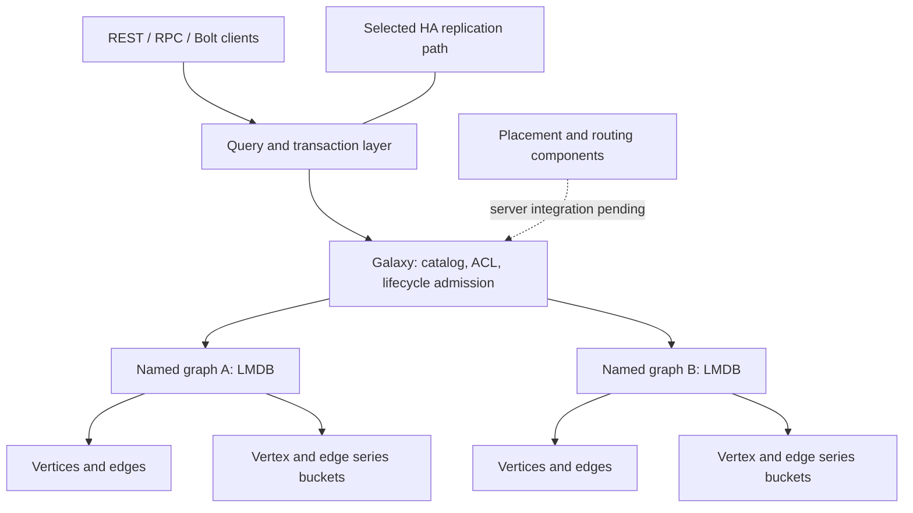

# GraphFin architecture

This index joins the multi-graph and time-series work streams. Individual reports
retain their original revision scope; consult the [current capability matrix](../product.md)
before interpreting historical figures or completion labels.

A graph's ordinary records and series buckets share a transaction domain.
Lazy loading and eviction bound open graph resources; retained transactions pin
their graph. HA and series need joint qualification on the merged binary.
Placement components do not yet provide a complete distributed request path.

| Topic | Documents |
| --- | --- |
| Graph lifecycle | [Original lifecycle](01-graph-lifecycle.md), [lazy loading and eviction](10-graph-lifecycle-v2.md) |
| Storage and transactions | [Storage baseline](02-storage-and-transactions.md), [series contracts](09-series-client-contracts.md) |
| Identity and access | [Metadata/ACL](03-metadata-and-acl.md), [cluster metadata](11-cluster-metadata.md) |
| Replication | [HA architecture](04-ha-raft-replication.md), [durability guarantees](08-ha-durability-guarantees.md), [write-path audit](09-write-path-audit.md) |
| Recovery | [Backup, restore and snapshots](05-backup-restore-snapshot.md) |
| Request paths | [Server baseline](06-server-and-request-paths.md), [sharding status](12-sharding-status.md) |
| Memory and scope | [Memory footprint](13-memory-footprint.md), [intra-graph sharding boundary](14-intra-graph-sharding-note.md) |
| Qualification | [Post-merge tests](../testing/post-merge.md), [historical baseline](09-test-baseline.md) |

The [original Phase 0 overview](../history/architecture-phase0.md) is retained for
comparison, with local navigation updated for its archive location.
